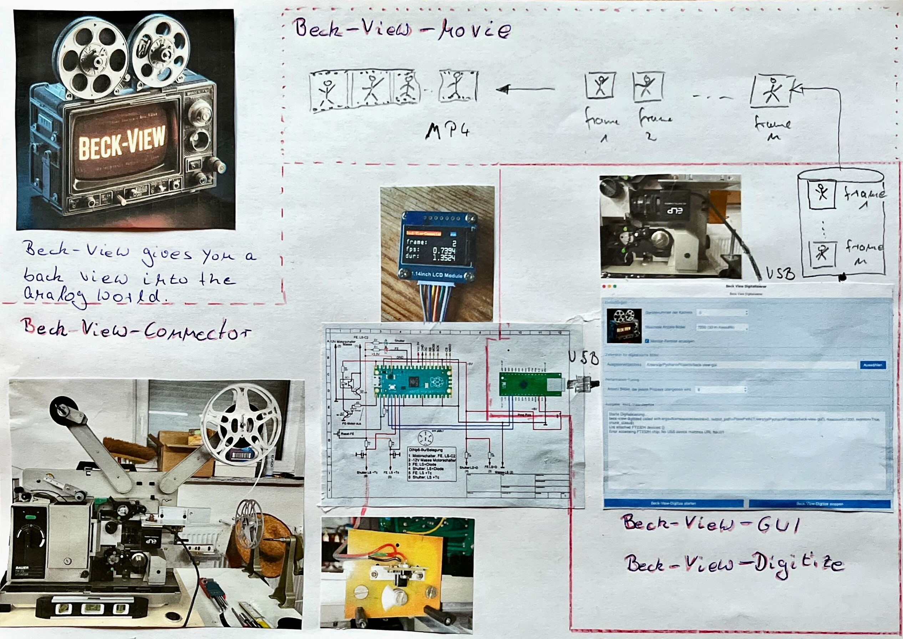

# beck-view-movie

[beck-view-movie](https://github.com/JuPfu/beck-view-movie) is a Python project designed to generate a movie from digitized frames (images) produced by the [beck-view-digitalize](https://github.com/JuPfu/beck-view-digitalize) project. This program converts a sequence of frames into a video file and supports parallel processing to optimize the performance when working with a large number of images.

## Table of Contents

- [Overview](#overview)
- [Features](#features)
- [Requirements](#requirements)
- [Installation](#installation)
- [Usage](#usage)
- [Examples](#examples)
- [License](#license)

## Overview

[beck-view-movie](https://github.com/JuPfu/beck-view-movie) is the second step in the process of digitizing Super V8 films. After the frames have been digitized and stored in an output directory by the [beck-view-digitalize](https://github.com/JuPfu/beck-view-digitalize) project, this program assembles the frames into a video file. The core method of this project utilizes parallel processing for efficient handling of a large number of images.



## Features

- Assembles digitized frames into a video file.
- Frames are sorted in the correct sequence to ensure proper chronological order in the video.
- Supports parallel processing for efficient handling of large image sets.
- Customizable frame rate (FPS) and output video file name.
- Supports batch processing, this means images are worked on in chunks - default chunk size is 100 images, to enhance performance.
- Logging for detailed information and progress tracking.
- An executable image <em>"beck-view-movie.exe"</em> can be generated with the help of Nuitka.

## Requirements

- Python 3.11 or higher
- Python packages used are specified in requirements.txt

## Installation

Clone the repository:
```shell
git clone https://github.com/JuPfu/beck-view-movie
cd beck-view-movie
```

Install the required dependencies:
```shell
pip install -r requirements.txt
```
Build executable <em>beck-view-movie.exe</em>:
### Windows
   ```bash
    install.bat
   ```

### MacOS
   ```bash
    install.sh
   ```


## Usage

To use the beck-view-movie program, you must run the script from the command line and provide the necessary arguments.

For help and information on usage, you can use the **--help** flag.

### Windows

```shell
  ./beck-view-movie.exe --help
```
### MacOS

```shell
  ./beck-view-movie --help
```
This will display a usage guide with information on the available arguments and their default values.

## Examples

Here's an example of how to run the program from the command line:

```shell
  python beck_view_movie.py -p /path/to/input/directory -o /path/to/output/directory -n my_movie -of wmf -fps 24 -wh 1280  720
```

In this example, the program will generate a movie with the resolution of 1280 x 720 pixles in wmf format named my_movie.wmf at 24 frames per second from PNG frames in the specified input directory. The output video file will be saved to the specified output directory.

You can run the program without any arguments to use the default values for each option.


Got it 👍 — here is a **clean, GitHub-flavoured Markdown** section, no custom blocks, no special syntax, and phrased for README consumption. You can paste this **as-is** into `README.md`.

---

## 🎞️ Output Quality Levels

Beck-View-Movie provides several predefined **quality levels** to balance **encoding speed**, **file size**, and **image fidelity**.
All levels use **FFmpeg with x264** and are tuned specifically for scanned film material (Super-8 / 16 mm), where grain, fine texture, and tonal stability are critical.

### Overview

| Quality | Intended Use                    | Encoding Speed | File Size  | Image Fidelity |
| ------: | ------------------------------- | -------------- | ---------- | -------------- |
| preview | Fast checks, UI preview         | Very fast      | Very small | Low–Medium     |
|    good | Everyday viewing                | Fast           | Small      | Good           |
|  better | High-quality delivery (default) | Medium         | Medium     | Very good      |
|    best | Near-master delivery            | Slow           | Large      | Excellent      |

---

## preview

**Purpose:** Fast iteration, GUI preview, test runs

**Characteristics**

* Minimal encoding complexity
* Very fast turnaround
* Suitable for checking framing, exposure, tone-mapping presets

**Trade-offs**

* Film grain is smoothed
* Fine detail may be lost
* Not suitable for final delivery

Use this mode when speed matters more than image quality.

---

## good

**Purpose:** Casual viewing and sharing

**Characteristics**

* Balanced speed and quality
* Broad player compatibility
* Reasonable grain preservation

**Trade-offs**

* Some grain simplification
* Minor banding possible in flat areas

A good choice for quick exports with acceptable visual quality.

---

## better

**Purpose:** High-quality delivery / archival viewing

**Characteristics**

* Careful compression
* Stable tones and edges
* Film grain preserved without exaggeration
* Consistent frame-to-frame behaviour

**Trade-offs**

* Slower encoding
* Larger files than *good*

Recommended for most users who digitise film seriously.

---

## best (default)

**Purpose:** Maximum image fidelity (near-master delivery)

**Characteristics**

* Very slow encoding
* Minimal psycho-visual optimisations
* Grain treated as image detail, not noise
* No artificial sharpening or contrast boosting

**Trade-offs**

* Long encoding times
* Large output files

Choose this mode when image quality is paramount and encoding time is secondary.

---

## Notes on Film Digitisation

All quality levels are tuned for scanned film sources:

* No aggressive adaptive quantisation
* No contrast-pumping psycho-visual tricks
* Stable grain reproduction across frames
* Explicit handling of full-range RGB → BT.709

If unsure, start with **better** — it offers the best compromise between quality, speed, and file size.

---

## License

[beck-view-movie](https://github.com/JuPfu/beck-view-movie) is licensed under the MIT License. See the [LICENSE](LICENSE) file for details.

## Information
This `README.md` file provides information on the project, its features, requirements, installation, usage, and examples. It is a comprehensive guide for anyone who wants to understand and use the [beck-view-movie](https://github.com/JuPfu/beck-view-movie) project. Let me know if you need any further assistance or adjustments!
